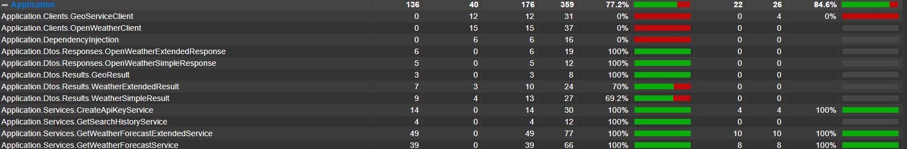

# Weather Forecast API

## Descrição

Esta aplicação fornece informações meteorológicas e histórico de buscas utilizando serviços externos como SQL Server para armazenamento e cache. A API foi desenvolvida em C# utilizando o framework ASP.NET Core.

## Tecnologias Utilizadas

- **C#**
- **ASP.NET Core**
- **SQL Server** (armazenamento de dados)
- **Docker** (containerização)
- **xUnit** (testes unitários)

## Coverage



## Configuração

### Pré-requisitos

- Docker e Docker Compose instalados.
- .NET SDK 9.0 ou superior.

### Passos para execução

1. Clone o repositório:

   ```bash
   git clone https://github.com/eoBraad/TesteTecnicoVeripag.git
   cd TesteTecnicoVeripag
   ```

2. Crie os containers docker

   ```bash
   docker-compose up --build
   ```

3. De update no database

   ```bash
   dotnet ef database update --project src/Infrastructure --startup-project src/Api
   ```
